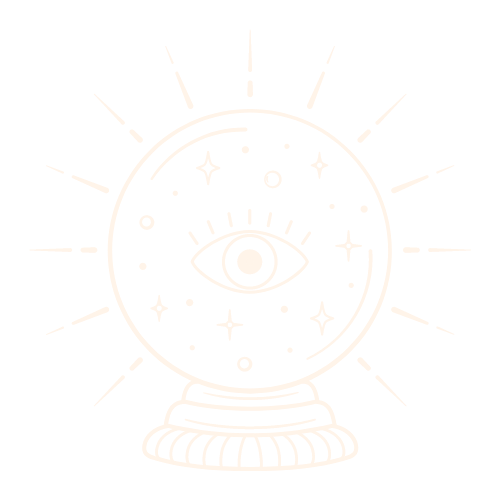

<div id="top"></div>


<!-- PROJECT LOGO -->
<br />
<div align="center">
  <a href="https://github.com/github_username/repo_name">
    
  </a>

<h3 align="center">Daily Horoscope</h3>

  <p align="center">
    Daily Horoscope is a web application for users to select their zodiac sign and view, not only their horoscope reading, but compatible sign, lucky number, mood and more!
  </p>
</div>


<!-- ABOUT THE PROJECT -->
## About The Project

<div>

</div>
<br>

The goal of this project was to familiarize myself with external api's and deliver them in an aesthetically pleasing way. Combine that with a love of all things astrological and Daily Horoscope is born! Check in daily to get a new horoscope reading and learn how to navigate the stars. If you have any questions or suggestions please do not hesitate to reach out via the contact information below.


### Built With


* [React.js](https://reactjs.org/)
  * React Hooks
* [JavaScript](https://developer.mozilla.org/en-US/docs/Web/JavaScript)
* [HTML](https://developer.mozilla.org/en-US/docs/Web/HTML)
* [CSS](https://developer.mozilla.org/en-US/docs/Web/CSS)

<!-- GETTING STARTED -->
## Getting Started

To get a local copy up and running follow these simple example steps.

### Installation

1. Get a free API Key at [https://rapidapi.com/sameer.kumar/api/aztro/](https://rapidapi.com/sameer.kumar/api/aztro/)
2. Clone the repo
   ```sh
   git clone https://github.com/J-Walters/daily-horoscope.git
   ```
3. Install NPM packages
   ```sh
   npm install
   ```
4. Enter your API in `Horoscope.js`
   ```js
   const API_KEY = 'ENTER YOUR API';
   ```
   
<!-- USAGE EXAMPLES -->
## Usage

<div>

</div>

<!-- ROADMAP -->
## Roadmap

- [ ] A user should be able to enter birthdate in modal and receive corresponding zodiac sign. 
- [ ] Create a favorite’s list of readings.
- [ ] Tweet/Email/Text reading (more sharing options)

Checkout out a detailed version of next steps for code and design [here](https://www.notion.so/Daily-Horoscope-60630f1037eb4fc398c0e53b9a122067)!

<!-- CONTRIBUTING -->
## Contributing

Contributions are what make the open source community such an amazing place to learn, inspire, and create. Any contributions you make are **greatly appreciated**.

If you have a suggestion that would make this better, please fork the repo and create a pull request. You can also simply open an issue with the tag "enhancement".
Don't forget to give the project a star! Thanks again!

1. Fork the Project
2. Create your Feature Branch (`git checkout -b feature/AmazingFeature`)
3. Commit your Changes (`git commit -m 'Add some AmazingFeature'`)
4. Push to the Branch (`git push origin feature/AmazingFeature`)
5. Open a Pull Request

<!-- CONTACT -->
## Contact

Jordan Walters - [LinkedIn](https://www.linkedin.com/in/walters-jordan/) - jwalters012@gmail.com - [GitHub](https://github.com/J-Walters)

Deployed Link: [https://dailyhoroscope-reading.netlify.app/](https://dailyhoroscope-reading.netlify.app/)

<!-- ACKNOWLEDGMENTS -->
## Acknowledgments

* [React Icons](https://react-icons.github.io/react-icons/search)
* [Aztro Astrology API](https://aztro.readthedocs.io/en/latest/)
* [Invisual Studio Art](https://www.canva.com/)
* [Coolors Palette](https://coolors.co/palette/8d6b94-b185a7-c3a29e-e8dbc5-fff4e9)

<p align="right">(<a href="#top">back to top</a>)</p>

